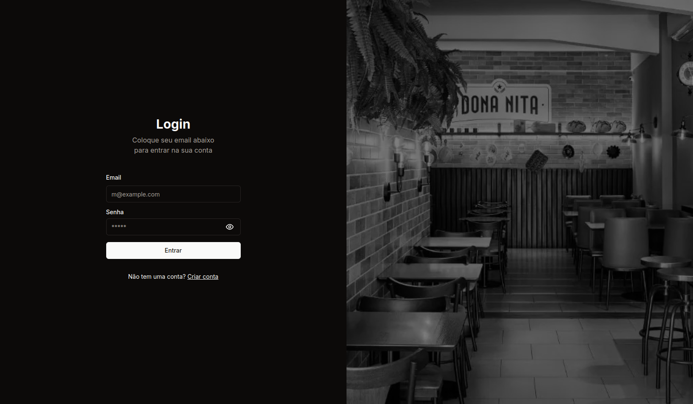
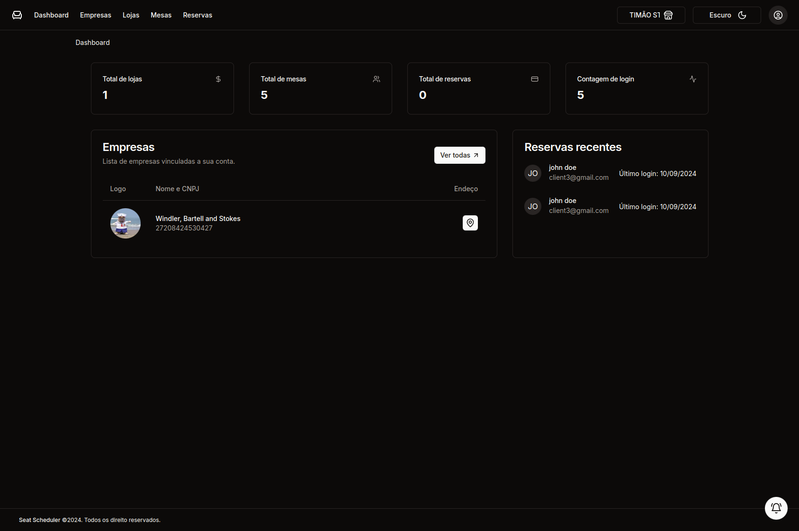
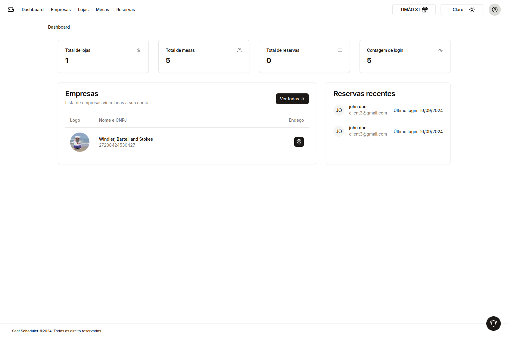
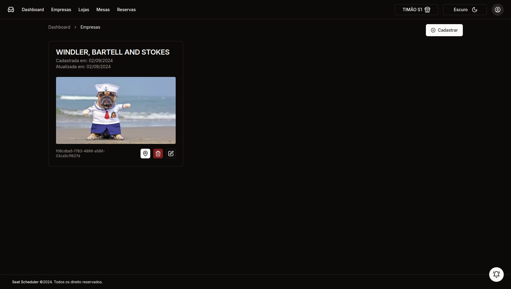
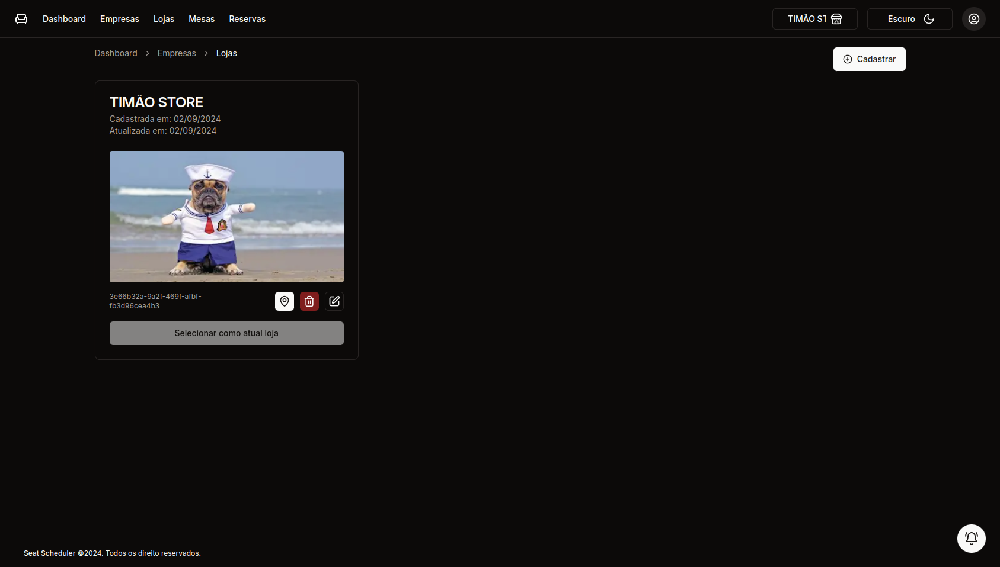
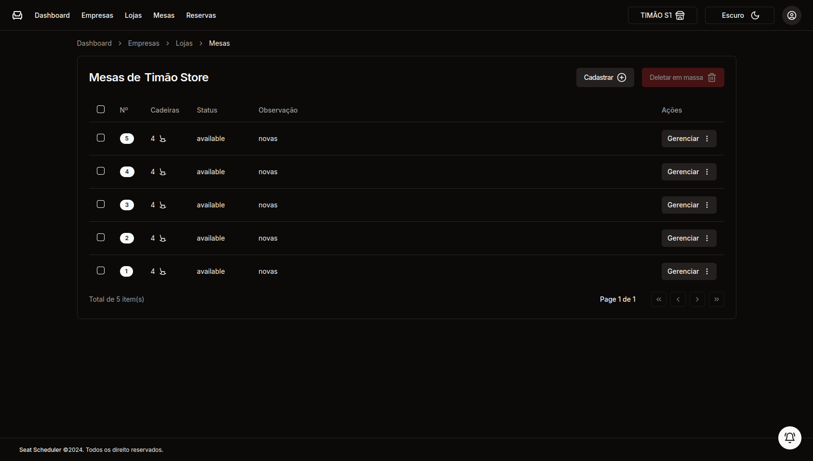
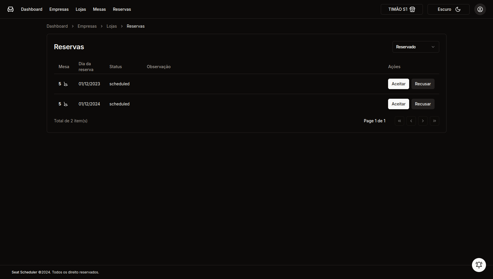
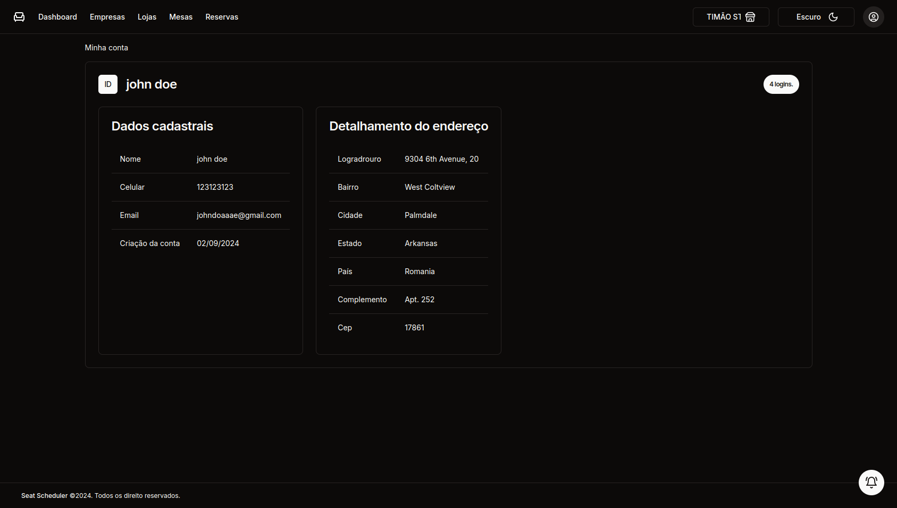

# Seat Scheduler

**Seat Scheduler** é uma aplicação para gerenciar reservas de mesas em restaurantes, permitindo que administradores aceitem ou cancelem reservas de forma simples e eficiente. A interface foi desenvolvida com **Next.js**, **TypeScript** e **ShadCN**, proporcionando uma experiência fluida tanto no tema escuro quanto no tema claro.

## Tecnologias Utilizadas
- **Next.js** - Framework React para renderização otimizada.
- **TypeScript** - Tipagem estática para maior segurança no código.
- **ShadCN** - Componentes estilizados com suporte a temas claro e escuro.

## Funcionalidades
- Cadastro de empresas e lojas.
- Aceitar e desmarcar reservas em tempo real.

## Imagens das Páginas

### Login

### Dashboard

### Empresas

### Lojas

### Mesas

### Reservas

### Minha conta
